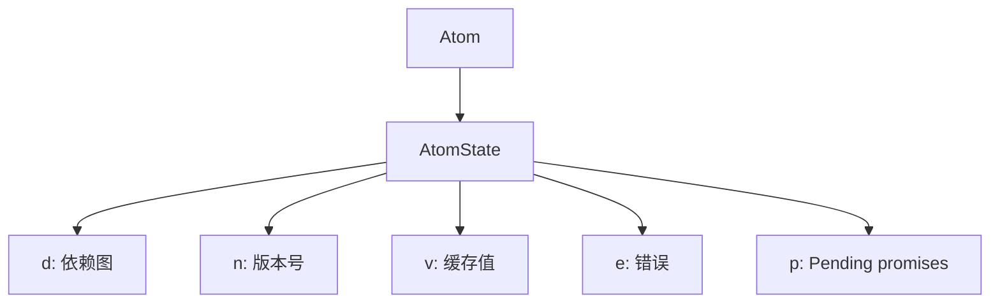
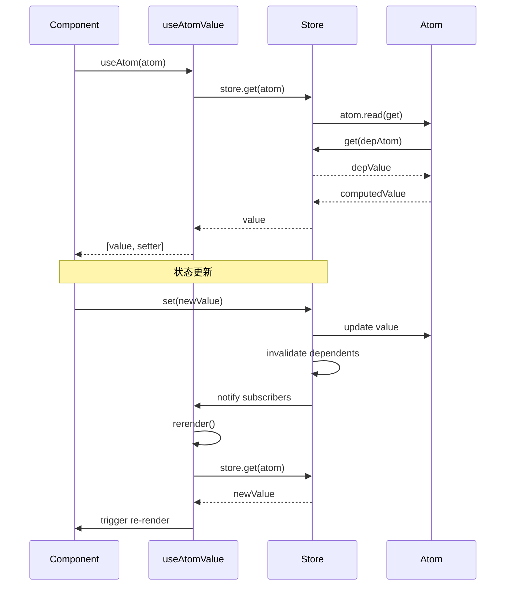

# Jotai 实现原理详解

## 目录

1. [概述](#概述)
2. [核心架构](#核心架构)
3. [Atom 实现原理](#atom-实现原理)
4. [Store 系统](#store-系统)
5. [依赖追踪](#依赖追踪)
6. [响应式系统](#响应式系统)
7. [React 集成](#react-集成)

---

## 概述

Jotai (Japanese: "state") 是一个原始而灵活的 React 状态管理库。其核心理念是：

> **"Atoms are the building blocks of state."**
> （原子是状态的构建块）

### 核心特点

| 特点 | 说明 |
|------|------|
| **原始性** | API 极简，一个 `atom()` 函数解决一切 |
| **灵活性** | 可以组合任意数量的原子，无需预定义 store |
| **性能** | 按需渲染，只有使用该原子的组件才会重新渲染 |
| **类型安全** | 完整的 TypeScript 支持 |
| **框架无关** | 核心层不依赖 React，可用于任何框架 |

### 代码结构

```
src/
├── vanilla/          # 框架无关核心层
│   ├── atom.ts      # Atom 类型和工厂函数
│   ├── store.ts     # Store 创建 API
│   ├── internals.ts # 核心实现（1000+ 行，Jotai 的心脏）
│   └── utils/       # 原子创建工具函数
├── react/            # React 集成层
│   ├── Provider.ts  # React Context Provider
│   ├── useAtom.ts   # useAtom Hook
│   ├── useAtomValue.ts
│   └── useSetAtom.ts
└── babel/            # Babel 插件
    └── plugin-debug.ts
```

---

## 核心架构

### 设计哲学

Jotai 采用 **"Bottom-Up"（自底向上）** 的状态管理方式：

```
传统方式 (Redux/Zustand):
          Store (大型状态树)
              ↓
    ┌─────────┼─────────┐
    ↓         ↓         ↓
  Slice1   Slice2   Slice3

Jotai 方式:
    Atom1    Atom2    Atom3    ... 原子化状态
       ↓        ↓        ↓
    └─────────┼─────────┘
              ↓
    DerivedAtom (派生原子)
```

### 三层架构

```
┌─────────────────────────────────────────────┐
│           React Integration Layer           │
│  (Provider, useAtom, useAtomValue, etc.)    │
├─────────────────────────────────────────────┤
│            Vanilla Core Layer               │
│    (atom, store, internals - 框架无关)      │
├─────────────────────────────────────────────┤
│          JavaScript/TypeScript              │
│         (WeakMap, Map, Set, Proxy)          │
└─────────────────────────────────────────────┘
```

---

## Atom 实现原理

### Atom 工厂函数

```typescript
// src/vanilla/atom.ts

let keyCount = 0

export function atom<Value, Args extends unknown[], Result>(
  read?: Value | Read<Value, SetAtom<Args, Result>>,
  write?: Write<Args, Result>,
) {
  const key = `atom${++keyCount}`  // 唯一标识符
  const config = {
    toString() {
      return key
    }
  } as WritableAtom<Value, Args, Result> & { init?: Value }

  if (typeof read === 'function') {
    config.read = read
  } else {
    config.init = read  // 原始原子的初始值
    config.read = defaultRead
    config.write = defaultWrite
  }

  return config
}
```

### Atom 类型系统

```typescript
// Getter - 获取依赖原子值的函数
type Getter = <Value>(atom: Atom<Value>) => Value

// Setter - 设置原子值的函数
type Setter = <Value, Args extends unknown[], Result>(
  atom: WritableAtom<Value, Args, Result>,
  ...args: Args
) => Result

// Read 函数签名
type Read<Value, SetSelf = never> = (
  get: Getter,
  options: {
    readonly signal: AbortSignal
    readonly setSelf: SetSelf
  }
) => Value

// Write 函数签名
type Write<Args extends unknown[], Result> = (
  get: Getter,
  set: Setter,
  ...args: Args
) => Result

// 基础 Atom 接口
interface Atom<Value> {
  toString: () => string
  read: Read<Value>
  debugLabel?: string
}

// 可写 Atom 接口
interface WritableAtom<Value, Args, Result> extends Atom<Value> {
  read: Read<Value, SetAtom<Args, Result>>
  write: Write<Args, Result>
  onMount?: OnMount<Args, Result>
}
```

### 三种 Atom 类型

#### 1. 原始原子 (Primitive Atom)

存储实际值的原子：

```typescript
const countAtom = atom(0)
// 内部结构:
// {
//   toString: () => "atom1",
//   init: 0,
//   read: defaultRead,
//   write: defaultWrite
// }
```

#### 2. 只读派生原子 (Read-only Derived Atom)

基于其他原子计算的值：

```typescript
const doubledAtom = atom((get) => get(countAtom) * 2)
// 内部结构:
// {
//   toString: () => "atom2",
//   read: (get) => get(countAtom) * 2
// }
```

#### 3. 可写派生原子 (Writable Derived Atom)

带有自定义写入逻辑的计算原子：

```typescript
const incrementAtom = atom(
  (get) => get(countAtom),
  (get, set) => set(countAtom, get(countAtom) + 1)
)
```

---

## Store 系统

### Building Blocks 模式

Jotai Store 使用独特的 **"积木块"（Building Blocks）** 模式：

```typescript
// src/vanilla/internals.ts

type BuildingBlocks = [
  // 0-6: Store 状态容器
  atomStateMap: AtomStateMap,        // WeakMap<AnyAtom, AtomState>
  mountedMap: MountedMap,             // WeakMap<AnyAtom, Mounted>
  invalidatedAtoms: InvalidatedAtoms, // WeakMap<AnyAtom, EpochNumber>
  changedAtoms: ChangedAtoms,         // Set<AnyAtom>
  mountCallbacks: Callbacks,          // Set<() => void>
  unmountCallbacks: Callbacks,        // Set<() => void>
  storeHooks: StoreHooks,             // Hook 函数集合

  // 7-10: Atom 拦截器
  atomRead, atomWrite, atomOnInit, atomOnMount,

  // 11-20: 积木块函数
  ensureAtomState,        // 确保 AtomState 存在
  flushCallbacks,         // 执行回调
  recomputeInvalidatedAtoms, // 重新计算失效原子
  readAtomState,          // 读取原子状态
  invalidateDependents,   // 使依赖失效
  writeAtomState,         // 写入原子状态
  mountDependencies,      // 挂载依赖
  mountAtom,              // 挂载原子
  unmountAtom,            // 卸载原子
  setAtomStateValueOrPromise, // 设置值或 Promise

  // 21-23: Store API
  storeGet,   // get(atom) -> value
  storeSet,   // set(atom, value)
  storeSub,   // sub(atom, listener) -> unsubscribe

  // 24: 扩展点
  enhanceBuildingBlocks
]
```

### AtomState 结构

每个原子的状态存储在 `AtomState` 中：

```typescript
type AtomState<Value> = {
  d: Map<AnyAtom, EpochNumber>  // 依赖及其版本号
  p: Set<AnyAtom>               // 依赖于该原子的 pending promises
  n: EpochNumber                // 当前版本/纪元号
  v?: Value                     // 缓存的值
  e?: Error                     // 错误（如果有）
}
```



### Mounted 结构

跟踪原子的挂载状态和订阅关系：

```typescript
type Mounted = {
  l: Set<() => void>      // 监听器列表
  d: Set<AnyAtom>         // 该原子使用的依赖
  t: Set<AnyAtom>         // 使用该原子的依赖者
  u?: () => void          // 清理函数
}
```

### Store API

```typescript
interface Store {
  // 读取原子值
  get<Value>(atom: Atom<Value>): Value

  // 写入原子值
  set<Value, Args, Result>(
    atom: WritableAtom<Value, Args, Result>,
    ...args: Args
  ): Result

  // 订阅原子变化
  sub(atom: AnyAtom, listener: () => void): () => void
}
```

---

## 依赖追踪

### 依赖收集过程

当读取一个派生原子时，Jotai 会自动收集其依赖：

```typescript
// 示例代码
const baseAtom = atom(10)
const doubledAtom = atom((get) => get(baseAtom) * 2)

// 当执行 store.get(doubledAtom) 时:
// 1. 调用 doubledAtom.read(get)
// 2. get(baseAtom) 触发依赖收集
// 3. 将 baseAtom 记录到 doubledAtom 的 AtomState.d 中
```

### 依赖图构建

```
doubledAtom (n=3)
  └── dependencies: Map { baseAtom => 5 }

baseAtom (n=5)
  └── dependencies: Map {}

updateAtom (n=2)
  ├── dependencies: Map { countAtom => 7, nameAtom => 3 }
  └── dependents: Set { listAtom }
```

### 依赖失效传播

当原子变化时，Jotai 使用深度优先遍历来传播失效：

```typescript
function invalidateDependents(atom: AnyAtom): void {
  const mounted = getMounted(atom)
  if (!mounted) return

  // 拓扑排序：深度优先遍历
  const stack = [atom]
  const order = []

  while (stack.length) {
    const a = stack.pop()!
    order.push(a)

    mounted.t?.forEach((dependent) => {
      stack.push(dependent)
    })
  }

  // 按相反顺序标记失效
  for (const a of order.reverse()) {
    invalidatedAtoms.set(a, currentEpoch)
  }
}
```

### Epoch（纪元）版本控制

Jotai 使用递增的 Epoch 号来高效检测变化：

```typescript
let epoch = 0

// 每次写入增加 epoch
function writeAtomState(atom) {
  const atomState = getAtomState(atom)
  atomState.n = ++epoch  // 更新版本号

  // 标记所有依赖者失效
  invalidateDependents(atom)
}

// 检查是否需要重新计算
function readAtomState(atom) {
  const atomState = getAtomState(atom)

  for (const [dep, depEpoch] of atomState.d) {
    if (depEpoch !== getAtomState(dep).n) {
      // 依赖版本变化，需要重新计算
      return recompute(atom)
    }
  }

  return atomState.v  // 返回缓存值
}
```

---

## 响应式系统

### 更新流程

```
┌─────────────────────────────────────────────────────────────┐
│  1. 组件调用 setAtom(newValue)                               │
└────────────────────┬────────────────────────────────────────┘
                     ↓
┌─────────────────────────────────────────────────────────────┐
│  2. writeAtomState()                                         │
│     - 更新 AtomState.v                                       │
│     - 递增 AtomState.n (epoch)                               │
└────────────────────┬────────────────────────────────────────┘
                     ↓
┌─────────────────────────────────────────────────────────────┐
│  3. invalidateDependents()                                   │
│     - 深度优先遍历依赖图                                      │
│     - 标记所有依赖者失效                                      │
└────────────────────┬────────────────────────────────────────┘
                     ↓
┌─────────────────────────────────────────────────────────────┐
│  4. recomputeInvalidatedAtoms()                              │
│     - 拓扑排序失效原子                                        │
│     - 按正确顺序重新计算                                      │
└────────────────────┬────────────────────────────────────────┘
                     ↓
┌─────────────────────────────────────────────────────────────┐
│  5. flushCallbacks()                                         │
│     - 通知所有订阅者                                          │
└────────────────────┬────────────────────────────────────────┘
                     ↓
┌─────────────────────────────────────────────────────────────┐
│  6. 组件重新渲染 (通过 useReducer dispatch)                   │
└─────────────────────────────────────────────────────────────┘
```

### 核心响应式特性

| 特性 | 实现方式 |
|------|---------|
| **按需订阅** | 组件只订阅其使用的原子 |
| **精确更新** | 只有直接依赖变化原子的组件才更新 |
| **延迟计算** | 原子在访问时才计算，并缓存结果 |
| **自动依赖追踪** | 通过 `get()` 自动收集依赖 |
| **拓扑重算** | 确保派生原子按正确顺序更新 |

---

## React 集成

### useReducer 技巧

Jotai 使用 `useReducer` 来实现高效的重新渲染：

```typescript
// src/react/useAtomValue.ts

export function useAtomValue<Value>(atom: Atom<Value>) {
  const store = useStore()

  const [[valueFromReducer, storeFromReducer, atomFromReducer], rerender] =
    useReducer(
      (prev) => {
        const nextValue = store.get(atom)

        // 使用 Object.is 比较避免不必要的渲染
        if (
          Object.is(prev[0], nextValue) &&
          prev[1] === store &&
          prev[2] === atom
        ) {
          return prev  // 无变化，阻止渲染
        }

        return [nextValue, store, atom]  // 有变化，触发渲染
      },
      undefined,
      () => [store.get(atom), store, atom]
    )

  useEffect(() => {
    const unsub = store.sub(atom, () => {
      rerender()  // 原子变化时强制重新检查
    })
    return unsub
  }, [store, atom, rerender])

  return valueFromReducer
}
```

### useAtom Hook

```typescript
// src/react/useAtom.ts

export function useAtom<Value, Args extends unknown[], Result>(
  atom: WritableAtom<Value, Args, Result>
): [Value, SetAtom<Args, Result>] {
  const store = useStore()

  // 读取值
  const value = useAtomValue(atom)

  // 创建稳定的 setter 引用
  const setAtom = useCallback(
    (...args: Args) => {
      return store.set(atom, ...args)
    },
    [store, atom]
  )

  return [value, setAtom]
}
```

### Provider 组件

```typescript
// src/react/Provider.ts

const StoreContext = createContext<Store | null>(null)

export function Provider({
  store,
  children,
}: {
  store?: Store
  children: ReactNode
}) {
  const storeRef = useRef<Store>()

  if (!storeRef.current) {
    storeRef.current = store ?? createStore()
  }

  return (
    <StoreContext.Provider value={storeRef.current}>
      {children}
    </StoreContext.Provider>
  )
}
```

### React 集成流程



---

## 性能优化

### 1. WeakMap 自动清理

使用 `WeakMap` 存储 AtomState，未使用的原子会被自动垃圾回收：

```typescript
const atomStateMap = new WeakMap<AnyAtom, AtomState>()

// 当 atom 不再被任何地方引用时
// AtomState 会自动被 GC 清理
```

### 2. 值缓存

```typescript
type AtomState<Value> = {
  v?: Value  // 缓存计算结果
}

// 读取时先检查缓存
function readAtomState(atom) {
  const atomState = getAtomState(atom)
  if (!isInvalid(atom)) {
    return atomState.v  // 返回缓存
  }
  // 重新计算并缓存
  atomState.v = atom.read(get)
  return atomState.v
}
```

### 3. 精确订阅

```typescript
// 只订阅组件实际使用的原子
const Component = () => {
  const [count] = useAtom(countAtom)
  // 只订阅 countAtom，nameAtom 变化不会触发重渲染
  return <div>{count}</div>
}
```

### 4. 批量更新

```typescript
// 使用 batchFn 批量更新
import { batch } from 'jotai'

batch(() => {
  set(atom1, 1)
  set(atom2, 2)
  set(atom3, 3)
})
// 只触发一次重渲染
```

---

## 总结

### Jotai 的核心优势

1. **极简 API** - 只需掌握 `atom()` 和 `useAtom()`
2. **自动优化** - 智能依赖追踪和按需渲染
3. **灵活组合** - 无限组合派生状态
4. **类型安全** - 完整的 TypeScript 支持
5. **零样板代码** - 无需定义 actions、reducers

### 与其他状态库对比

| 特性 | Jotai | Redux | Zustand | Recoil |
|------|-------|-------|---------|--------|
| 状态模型 | 原子化 | 单一树 | 单一对象 | 原子化 |
| 样板代码 | 极少 | 较多 | 少 | 少 |
| 按需渲染 | ✓ | 需要选择器 | 需要选择器 | ✓ |
| DevTools | ✓ | ✓ | ✓ | ✓ |
| 包大小 | 2.9kb | 1.2kb | 1.2kb | 22kb |

### 关键技术

- **WeakMap** - 自动内存管理
- **拓扑排序** - 正确的更新顺序
- **Epoch 版本号** - 高效变化检测
- **useReducer** - React 集成的优化渲染
- **依赖图** - 自动追踪状态关系

---

## 参考资源

- [Jotai 官方文档](https://jotai.org/)
- [Jotai GitHub 仓库](https://github.com/pmndrs/jotai)
- src/vanilla/internals.ts - 核心实现
- src/vanilla/atom.ts - Atom 类型定义
- src/react/useAtomValue.ts - React 集成
